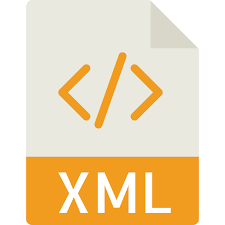

<h1 align="center">Civilization Game</h1>

<h2>Description</h2>

  Civilization is a simulation game where the player manages and defends a small civilization. The player's civilization has resources (food, wood, iron, mana), buildings (farms, carpentry, smithy, magic towers, churches), technologies (defense and attack), and military units (offensive units like swordsmen, spearmen, crossbowmen, cannons; defensive units like arrow towers, catapults, rocket launcher towers; and special units like magicians and priests).

  The goal is to survive constant attacks from enemy civilizations by carefully managing resources, upgrading technologies, constructing buildings, and building a strong army with a good mix of offensive, defensive, and special units.

  The game features a detailed combat system where attacking and defending groups of units are randomly selected based on probability calculations. Units deal damage, lose armor, have chances to attack again, and can generate material waste when defeated, which the player can collect after winning battles.

<h2>Screenshots</h2>

Screenshots from the game

<h2>Languages and Technologies</h2>

  
  
  
  
  
  
  
  

<h2>Controls</h2>

Point and click controls

<h2>Collaborators</h2>

  <a href="https://github.com/OscarMG018">Óscar MG018</a> 
  <a href="https://github.com/AdrianCasadoAguilera">Adrián Casado Aguilera</a> 
  <a href="https://github.com/AAyoubelbakhti">Ayoub El Bakhti</a> 
  <a href="https://github.com/MarcArques">Marc Arqués Marimón</a>

